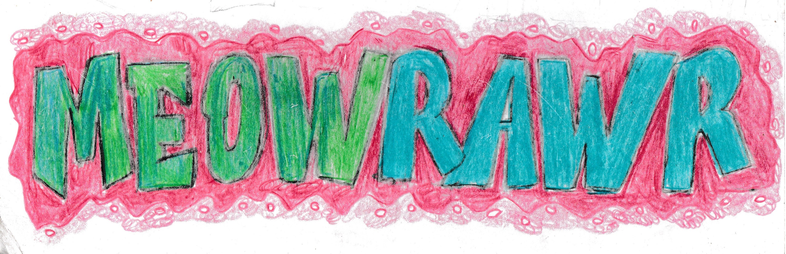

<a id="portada"></a><h1 style="text-align: center; color: #980000;">1.1 Portada</h1>
<div style="text-align:center"></div>

Nombre del grupo: **Grupo 6**

Nombres de los integrantes:  **Alejandra Balbontin M.**,  **Oliver Espinoza C.**

Nombre del caso de estudio:  **Empresa de Venta de Maquillajes y Manejo de Stock**


<a id="indice"></a><h1 style="text-align: center; color: #980000;">1.1 Indice</h1>  

[1.1 Portada](#portada)

[1.2 Indice](#indice)

[1.3 Introduccion](#introduccion)

[1.3.1 Breve resumen del caso](#resumen)

[1.3.2 Objetivos del caso](#objetivos)

[2.1 Analisis de requisitos](#analisis)

[2.1.1 Requisitos funcionales](#funcionales)

[2.1.2 Requisitos no funcionales](#nofuncionales)

[2.2 Diseño seguro](#diseno)

[2.3 Implementacion segura](#implementacion)

[2.3.1 Seguir guia SGSI de la ISO 27001](#sgsi)

[2.4 Pruebas y validación](#pruebas)

[2.5 Documentacion](#documentacion)

[2.5.1 Documentación de sistema](#sistema)

[2.5.2 Documentación de instalación](#instalacion)

[2.5.3 Documentación de usuario](#usuario)

[A.1 Conclusion](#conclusion)

[A.2 Referencias](#referencias)

<a id="introduccion"></a><h1 style="text-align: center; color: #980000;">1.3 Introduccion</h1>

<p style="color: #666666; font-weight: bold;">(Empresa de Venta de Maquillajes y Manejo de Stock)


<a id="resumen"></a><h2 style="text-align: center; color: #4a86e8;">1.3.1 Breve resumen del caso</h2>

Ofrecer productos cosméticos que aporten una experiencia positiva al consumidor 

Teniendo precios rebajados a la competencia 

Entregando confianza 

<a id="objetivos"></a><h2 style="text-align: center; color: #4a86e8;">1.3.2 Objetivos del caso</h2>

Crear informe que explique paso a paso la forma de implementar un sistema de ventas a través de la web usando estándares internacionales de infosec, …?

<a id="analisis"></a><h1 style="text-align: center; color: #980000;">2.1 Analisis de requisitos</h1>

Los requisitos funcionales y no funcionales para el correcto e ideal uso de este sistema de ventas, son:

<a id="funcionales"></a><h1 style="text-align: center; color: #980000;">2.1.1 Requisitos funcionales</h1>

Seguridad en privilegios de usuario : es el derecho de una cuenta de usuario para poder realizar varias l relacionadas con el sistema en el equipo local
* Cambiar contraseñas cada mes
* Hardware firewall   
* Proxy inverso?: (Actúa como intermediario entre usuario y servidor web, puede ser configurado como IPS y ayudar a mitigar ataques DDoS)
* Intrusion Prevention System
* Implementar CI/CD para mayor seguridad
* Interfaz de venta de productos cosméticos
* Interfaz de manejo de stock

…

<a id="nofuncionales"></a><h2 style="text-align: center; color: #4a86e8;">2.1.2 Requisitos no funcionales</h2>

* Manual de sistema
* Capacita a los empleados a administrar el sistema usando protocolos seguros
* Charlas semanales de seguridad
* Intrusion Detection System
* Servicios cloud confiables
* Dockers

<a id="diseno"></a><h1 style="text-align: center; color: #980000;">2.2 Diseño seguro</h1>

* Sanitización de campos de entrada (Medida contra ataque de inyección SQL)
* Requerir contraseñas seguras y Multiple Factor Authentication usando Auth0
* Nivel de permisos entre usuarios (Usuario/Logistica/…/Administrador)
* Usar mysql para almacenar hash salteado  de contraseña

<a id="implementacion"></a><h1 style="text-align: center; color: #980000;">2.3 Implementacion segura</h1>

Una implementación segura de este sistema requiere un trabajo continuo de monitorización y mejora para cumplir con los estándares de calidad óptimos, el proceso será cíclico, y teniendo enfoque a distintos puntos sensibles donde puedan existir vulnerabilidades (Como el de inyección SQL):

<a id="sgsi"></a><h2 style="text-align: center; color: #4a86e8;">2.3.1 Seguir guia SGSI de la ISO 27001</h2>

* Entender los requisitos de seguridad de la empresa, y la necesidad de establecer políticas y objetivos para la seguridad de la información
* Implementar y operar controles para gestionar los riesgos de la seguridad de la información en contexto de la venta de productos y gestión de stock a través de la web
* Monitorizar y evaluar el rendimiento y efectividad del SGSI
* Continua mejora basada en medición objetiva

Esto se logra siguiendo el método PDCA (Plan, Do, Check, Act)

* Uso de Zapier para flujos de trabajos automatizados
* (Evitar XSS)
* Usar y mantener servidores actualizados
* (Implementar SIEM)

Metodo de trabajo CI/CD para trabajo en frontend, backend, dockers y MySQL

<a id="pruebas"></a><h1 style="text-align: center; color: #980000;">2.4 Pruebas y validación</h1>

* Pentesting con OpenVAS, Metaexploit, y ataques fuzz
* Usar test suites y test cases exaustivos usado para analisis de codigo estático y dinámico, como ESLint y Bandit, para prevenir ataques XSS, inyeccion SQL, sanitisacion de entrada

<a id="documentacion"></a><h1 style="text-align: center; color: #980000;">2.5 Documentacion</h1>

(Implementar SIEM)

<a id="sistema"></a><h2 style="text-align: center; color: #4a86e8;">2.5.1 Documentación de sistema</h2>

El inmueble de la empresa se encuentra en la ciudad de Valparaíso, consta de 3 pisos cada uno equipado con detector de humo y red de cámaras,

<span style="color: #980000;">Primer piso</span> contiene

* Via de escape 
* Extintor de classe tipo c 
* Extintor de clase tipo a
* Bodega y lockers
* Red de camaras 
* Detector de humo 
* Baño 1 
* Baño 2

<span style="color: #980000;">Segundo piso</span> contiene:

* Extintor de clase tipo c
* Extintor cde classe tipo a
* Baño 1
* Baño 2
* Oficinas de empleados 
* Cuarto de dispositivos de red (modem, routers)

Dos enrutadores estan conectados cada a uno a un firewall de hardware distinto, en redes aisladas, una es de uso de invitados, con un servidor DNS que solo especifica dominios de WhatsApp, Google y Wikipedia y permite coneccion Wi-Fi usando WPA 3 para cifrado, y una clave en constante cambio, y otro enrutador para uso de trabajadores de la empresa. 

Habitación cerrada con lockers de los trabajadores y artículos de uso de la trabajadora del aseo.

Base de datos de trabajadores usa Blockchain para garantizar que es aprueba de manipulación, y pagos, asistencia, y faltas puedan ser rastreables, se usa servicio AWS de Amazon como hosting por su gran prestigio en cuanto a seguridad, y disponibilidad de servicio

Tercer piso consta con sala de reuniones, que se usa para dar capacitación y charlas de seguridad a empleados

Se proveen posters que describen uso correcto de extintor clase A y C,  cerca de los extintores

<div style="text-align:center"></div>

Se mantiene registro de todo evento en la organización, relacionados con activos, y casos relacionados con la seguridad de la organización

<a id="instalacion"></a><h2 style="text-align: center; color: #4a86e8;">2.5.2 Documentación de instalación</h2>

Este sistema usa la distribución Arch Linux por su sistema de rolling update, que permite actualización continua en un sistema sin tener que volver a instalar el OS por cada versión mayor lanzada de este;  primero instalamos SSH servidor web Apache, MariaDB, PHP, extension de Apache 

`sudo pacman -Syy openssh apache php php-fpm libxml2 icu mariadb sudo base-debel git dns tools wget cronie`

Configurar Apache para usar PHP-FPM, que tiene opciones útiles para paginas de gran carga, descomentar las siguientes lineas en `/etc/httpd/conf/httpd.conf`:

```
#LoadModule proxy_module modules/mod_proxy.so
#LoadModule proxy_fcgi_module modules/mod_proxy_fcgi.so
```

Y añadiendo esta

Crea `/etc/httpd/conf/extra/php-fpm.conf` con el siguiente contenido:

```
DirectoryIndex index.php index.html
<FilesMatch \.php$>
    SetHandler "proxy:unix:/run/php-fpm/php-fpm.sock|fcgi://localhost/"
</FilesMatch>
```

Activa y comienza el servidor web con:

```
sudo systemctl start httpd
sudo systemctl enable httpd
```

Crea un par de llaves asimetricas para entrar a ssh de servidor de forma mas segura:

`ssh-keygen -m PEM -t rsa -b 4096`

Copia la llave publica a archivo ~/.ssh/authorized_keys para tener acceso por ssh usando la llave par privada, y otorgarle  permisos seguros:

```
cd .ssh
cat id_rsa.pub >> authorized_keys
chmod 600 authorized_keys
cd
```

Entrar a configuracion de SSH con:

`sudo nano /etc/ssh/sshd_config`

Y descomentar esta linea y cambiar yes por no, para que use autenticación  por llaves en lugar de por contraseña:

`# PasswordAuthentication yes`

Quedando asi:

`PasswordAuthentication no`

Reiniciar

`sudo systemctl restard sshd`

Se usa Let’s Encrypt como autoridad de certificados, y servicio (daemon) Certbot, para renovar automáticamente certificado antes de que expire

<a id="usuario"></a><h2 style="text-align: center; color: #4a86e8;">2.5.3 Documentación de usuario</h2>

Para comprar, tienes dirigir a l sitio web donde este te llevara a la página de nuestra empresa 

Podrás ver  en nuestra página los catálogos de los productos cuando desees comprar un producto puedes hacer un click en el producto este te llevará un carrito de compras 

Donde quedará guardado 

Tienes que crear una cuenta de usuario y proveer un email o teléfono para autenticación multifactor   

Para darle mas seguridad al cliente ante robos de credenciales 

<a id="conclusion"></a><h1 style="text-align: center; color: #980000;">A.1 Conclusion</h1>

Lo que fue necesario implementar para la seguridad de la empresa y el servicio, 
De los clientes 

<a id="referencias"></a><h1 style="text-align: center; color: #980000;">A.2 Referencias</h1>

Wikipedia…

Google 

Iso 27001

Arch wiki
