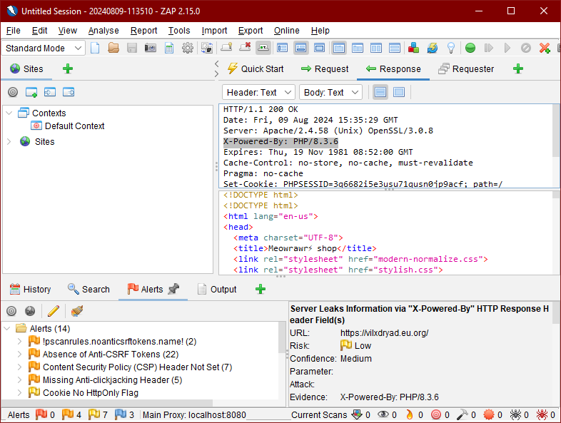

# Informe forense:  CSRF en https://vilxdryad.eu.org/

## Resumen ejecutivo

Este informe detalla vectores de ataque CSRF en nuestro sitio web, y otros que puede potencialmente comprometer informacion de usuarios y exponer al servidor.

## Introducción

https://vilxdryad.eu.org/ es el dominio donde actualmente se aloja nuestro sitio web de venta de maquillaje, y su gestion de stock, Meowrawr.  Herramienta de pentesting de OWASP, Zed Attack Proxy, nos da a conocer, y a posibles atacantes, maneras en las que se puede explotar el nivel de seguridad actual del sitio.  Oliver hace este informe

## Antecedentes del caso

Meowrawr utiliza Apache/2.4.58 (Unix), MariaDB 11.3.2, PHP 8.3.6 (fpm-fcgi) con Zend Engine v4.3.6:  Actualmente, dia 9 de Agosto de 2024, un atacante puede saber cuales son algunas de las verciones de servidores y software software instalado, y realizar ataques dirigidos a vulnerabilidades que puedan ser detectadas en estos;  un header HTTP actual del sitio revela tal información:
```
HTTP/1.1 200 OK
Date: Fri, 09 Aug 2024 15:35:29 GMT
Server: Apache/2.4.58 (Unix) OpenSSL/3.0.8
X-Powered-By: PHP/8.3.6
Expires: Thu, 19 Nov 1981 08:52:00 GMT
Cache-Control: no-store, no-cache, must-revalidate
Pragma: no-cache
Set-Cookie: PHPSESSID=3q6682i5e3usu71qusn0jp9acf; path=/
Content-Type: text/html; charset=UTF-8
content-length: 3475
```

Tambien tiene estas vulnerabilidades a Cross-site-request-forgery:

```
!pscanrules.noanticsrftokens.name!
Absence of Anti-CSRF Tokens
```

## Metodologia

### Herramientas

* Zed Attack Proxy de OWASP

### Procedimientos

* Tener en linea y en funcionamiento el servidor web de Meowrawr en https://vilxdryad.eu.org/
* Uso de Zed Attack Proxy para generar informe de vulnerabilidades
* Analisis de registro para mitigar todas los vectores de ataques reportados

### Tecnicas

Pruebas de penetracion automatizada

## Hallazgos

### Header HTML con informacion sensible

* Server: Apache/2.4.58 (Unix) OpenSSL/3.0.8
* X-Powered-By: PHP/8.3.6

## Analisis



### Linea de tiempo

No mucho despues de lanzar un prototipo del sitio a produccion en un dominio temporal, se hiso un analisis dinamico del sitio web utilizando Zed Attack Proxy para trabajar enrobustecer la calidad y seguridad del servicio

### Vectores de ataque

* CSRF: !pscanrules.noanticsrftokens.name!
* CSRF: Absence of Anti-CSRF Tokens
* XSS: Content Security Policy (CSP) Header Not Set
* Clickjacking: Missing Anti-clickjacking Header
* Info leak: Server Leaks Version Information via "Server" HTTP Response Header Field
* Info leak: Server Leaks Information via "X-Powered-By" HTTP Response Header Field(s)

### Impacto

Este es un informe preventivo, aun no se encuentra rastros de exploits a estas vulnerabilidades.

## Conclusiones

La investigacion concluyo que multiplos vectores de ataques se encuentran activos, que podrian comprometer a usuarios y al servidor web del sitio

## Recomendaciones

### A corto plazo

* Mitigar cada vulnerabilidad y oportunidad de mejora propuesta por Zed Attack Proxy

### A largo plazo

* Usar otros programas de analisis dinamico
* Actualizar software en servidor y analisis constantemente

## Anexos

* OWASP ZAP:  https://www.zaproxy.org/

