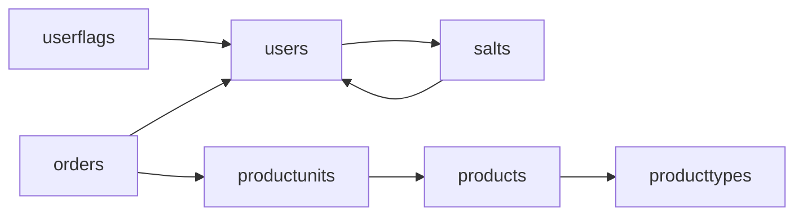

# 1.1 Manual sitio web de compras Meowrawr

Un trabajo en progreso de un sitio web de venta de maquillajes y desde donde se puede gestionar de su stock

# 1.2 Indice

* 1.1 Manual sitio web de compras Meowrawr
* 1.2 Indice
* 2.1 Manual de usuario
* 2.1.1 Introduccion
* 2.1.2 Objetivos del sistema
* 2.1.3 Guia de uso
* 2.1.4 Troubleshooting
* 2.1.5 Servicio al cliente
* 2.2 Manual de instalacion
* 2.3 Manual tecnico
* 2.3.1 Objetivo y alcances del sistema
* 2.3.2 Manual de Normas, políticas y procedimientos
* 2.3.3 Descripción de bases de datos y diagramas de relación
* 2.3.4 Diseño de reportes y pantallas.
* 3.1 Addendum

# 2.1 Manual de usuario
## 2.1.1 Introduccion

Este es un ejercicio de como hacer funcionar una sitio web de ventas de maquillaje y gestion de stock (Para staff) El sitio esta sujeto a cambio, y este manual puede no representar verciones futuras del sitio

## 2.1.2 Objetivos del sistema

Este proyecto pretende cumplir ser:

* Una plantilla de sitio para uso y modificacion para cumplir con las necesidades de emprendimiento

* Un sistema completo para emprendimiento de venta de productos

## 2.1.3 Guia de uso

En pestaña Config a la izquierda puedes crear un usuario, que te permitira realizar compras

Para buscar productos, usa la pestaña Search, tendras un listado de productos disponibles y una barra de busqueda

En la pagina de producto, puedes añadir producto a tu carro de compras

Desde la pagina del carro de comprar, puedes realizar la compra a traves de WebPay (Tentativamente) y ver compras anteriores

## 2.1.4 Troubleshooting

El sistema esta siendo trabajado en vivo, con cambios directamente a produccion, en esta etapa:  Si encuentras un error, ¡porfavor ntentalo de nuevo mas tarde!  Puedes comunicarte y recibir respuesta a preguntas a traves del correo meowrawr-ui@proton.me

## 2.1.5 Servicio al cliente

¡Problemas, preguntas y feedback son bienvenidos a este correo!  meowrawr-ui@proton.me  

# 2.2 Manual de instalacion

Este sistema fue probado en Arch Linux ARM en una Raspberry Pi 3B+, puede funcionar en otros sistemas adaptando estos pasos

* Instalar Arch Linux ARM

* Instalar paquetes necesarios con `sudo pacman -Syy apache mariadb php php-fpm openssh libxml2 icu sudo base-devel git dnstools wget cronie

* Configurar IP local estatica

* Usar freedns.afraid.org para configurar subdominio al que script cron actualize IP externa

* Usar nic.eu.org para subdominio gratis .eu.org  (NIC permite sitio de ventas?)

* Usar he.dns.net para crear record ALIAS de tu subdominio .eu.org a tu subdominio en freedns.afraid.org, y añadir registro .txt para busquedas en Google

* Instalar Apache con modulos php-fpm y mariadb, ver Arch Wiki para instrucciones de instalacion

* Crear Virtual Host en Apache para sitio en .eu.org

* Usar certbot de Let's Encrypt para tener sitio en HTTPS

# 2.3 Manual tecnico
## 2.3.1 Objetivo y alcances del sistema

Ser un sitio web de compras segura, se le planea dar la responsabilidad a WebPay para cumplir con PCI-DSS, si ellos lo cumplen

## 2.3.2 Manual de Normas, políticas y procedimientos

PCI-DSS para la gestion de informacion de tarjetas de creditos, esta plantilla le piensa dar la responsabilidad a otro sitio de esto

Monitorizacion IDS y logs y trafico de red para mitigar intentos de ataque, reportes a lo mas semanales de informes diarios, si no se encuentra un caso

## 2.3.3 Descripción de bases de datos y diagramas de relación

## 2.3.4 Diseño de reportes y pantallas.

Informes de malware en este formato:
* Resumen ejecutivo
* Introducción
* Antecedentes del caso
* Metodologia
    * Procedimientos
    * Tecnicas
* Hallazgos
* Analisis
    * Linea de tiempo
    * Vectores de ataque
    * Impacto
* Conclusiones
* Recomendaciones
    * A corto plazo
    * A largo plazo
* Anexos

Informes forenses en este formato:
* 1.1 Informe forense portada
* 1.2 Indice
* 2.1 Resumen ejecutivo
* 2.2 Introduccion
* 2.2.1 Antecedentes del caso 
* 2.2.2 Objetivos del analisis
* 2.3 Metodologia
* 2.3.1 Herramientas utilizadas
* 2.3.2 Procedimientos de adquisicion
* 2.3.3 Tecnicas de analisis
* 2.4 Hallazgos
* 2.4.1 Evidencia digital (archivos, registros, etc.)
* 2.4.2 Analisis de la red
* 2.4.3 Analisis de sistemas
* 2.5 Analisis
* 2.5.1 Interpretacion de los hallazgos
* 2.5.2 Linea de tiempo de los eventos
* 2.5.3 Posibles vectores de ataque
* 2.6 Conclusiones
* 2.6.1 Resumen de los hallazgos clave
* 2.6.2 Respuestas a las preguntas iniciales
* 2.7 Recomendaciones
* 2.7.1 Acciones a corto plazo
* 2.7.2 Acciones a largo plazo
* 2.7.3 Mejoras en los procesos de seguridad
* 2.8 Anexos
* 2.8.1 Logs completos
* 2.8.2 Capturas de pantalla
* 2.8.3 Reportes de herramientas
* 2.8.3 Evidencia digital adicional

# 3.1 Addendum

Este documento es un trabajo en progreso y el sistema experimental: Es sujeto a cambios en diseño y filosofia
